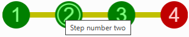

# Circles On Line: Anvil Custom Component

This package provides a reusable [Anvil](https://anvil.works) custom component that visually represents progress as a series of numbered circles arranged along a line. Each circle corresponds to a step, with customizable colors for the line, completed steps, and pending steps. The component is fully implemented in Python and demonstrates advanced techniques for dynamic graphics, event handling, and efficient redraw management.



## Features

- **Visual Progress Indicator:** Displays a horizontal line with circles representing each step. Each circle contains its step number.
- **Customizable Appearance:** Configure the colors for the line, completed circles, pending circles, and their respective text. The `height` property controls the size of the circles.
- **Interactive:** Clicking on a circle triggers an event, allowing your app to respond to user actions.
- **Dynamic Redraw:** The component efficiently manages redraws both at design time and runtime, ensuring smooth updates when properties change.
- **Debounced Redraws:** Redraw operations are debounced to prevent excessive rendering when multiple property changes occur in quick succession.
- **Tooltips:** Optionally display tooltips when hovering over each circle.

## Usage

1. **Add the Component:** Import and use the `CirclesOnLine` component in your Anvil app.
2. **Configure Properties:** Set the number of total steps (`n_circles_tot`), the number of completed steps (`n_circles_done`), and customize colors as needed.
3. **Handle Events:** Bind to the `click` event to respond when a user clicks a circle.
4. **Tooltips:** Optionally provide a list of tooltips for each circle.

## Technical Highlights

- **Custom Graphics:** All drawing is performed programmatically using Anvil's Canvas API, allowing for complete control over the component's appearance.
- **Property Management:** Uses property setters and a mixin to automatically schedule redraws when relevant properties change.
- **Debounce Logic:** Redraws are debounced using a timer to avoid performance issues from rapid property updates.
- **Event Handling:** Mouse events are handled to provide interactivity and feedback, including tooltips and cursor changes.

## Example

```python
# Example usage in an Anvil form
from CirclesOnLine import CirclesOnLine

class MyForm(MyFormTemplate):
    def __init__(self, **properties):
        self.init_components(**properties)
        self.circles = CirclesOnLine(
            n_circles_tot=5,
            n_circles_done=2,
            height=40,
            line_color="#c0c000",
            circle_todo_color="#c00000",
            circle_done_color="#008000",
            text_todo_color="#fecdcd",
            text_done_color="#80ff80",
            tooltips=["Step 1", "Step 2", "Step 3", "Step 4", "Step 5"]
        )
        self.circles.set_event_handler("click", self.circle_clicked)
        self.add_component(self.circles)

    def circle_clicked(self, n_circle, **event_args):
        anvil.alert(f"Clicked circle {n_circle}")
```

## Learning Points

- How to create a fully custom, code-driven Anvil component with dynamic graphics.
- Techniques for managing redraws in both design and runtime environments.
- How to debounce redraws to optimize performance.
- Implementing interactive, event-driven UI elements in Anvil.

## License

This project is licensed under the MIT License. See the [LICENSE](LICENSE) file for details.
